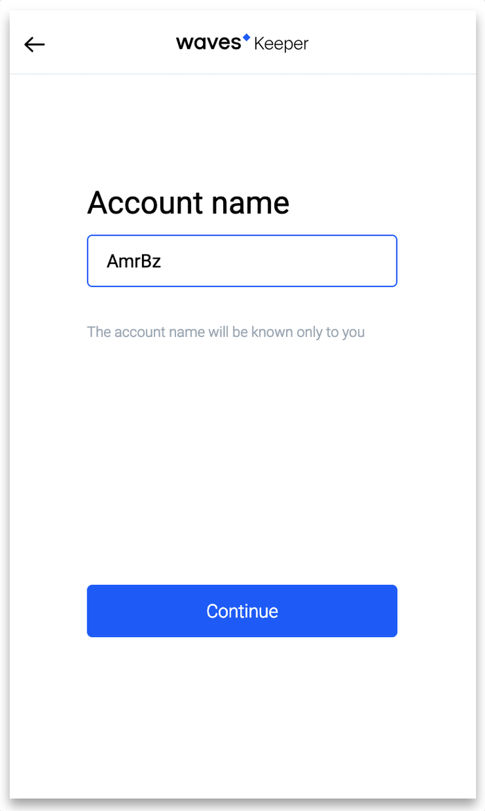

# Waves Keeper v1.0.8 [Chainify tune]

[Original Waves Keeper documentation](https://github.com/wavesplatform/waveskeeper/blob/master/README_en.md)

## Before you start
- This is a beta version of messaging application whisch means that nothing is stable
- Messaging works only for web browsers and not optimized for mobile yet
- Installation requires usage of our custom version of Waves Keeper. We had to create one because original keeper has no encryption functions build in. We are working close with Waves team to implement those functions to original version of Waves keeper

## Installation guide

Compile browser extensions
```
git clone git@github.com:chainify/waveskeeper.git keeper
cd keeper
npm i
npm run dist
```

As an alternative use Docker (for geeks who use docker containers as a development environment)
```
git clone git@github.com:chainify/waveskeeper.git keeper
cd keeper
docker run --it -d $PWD:/opt --name keeper node
docker exec -it keeper bash
cd /opt
npm i
npm run dist
```
### For Non-Technical users
- Just [download compiled crome extension here](https://drive.google.com/open?id=1BK8qFzd_ZKHilPbKyuhkCJsxdk_rzKtt)


### In your Chrome browser 

Open URL `chrome://extensions`

After that
- Swith to `Developer mode`
- Push **Load Unpacked** button
- Select `keepe/dist/chrome` folder and click **Select**. If you dowloaded the `chrome.zip` archive just unpack it and select that folder.


**Attention!**
In order to avoid conflicts please remove original Waves Keeper extention. `Make sure to save all your account seed phrases. Installing new waves extension does not import your accounts!` 

If you have't use Waves Keeper before, no action required.

***

## In Waves Keeper
Create a password


Switch Mainnet to Testnet


Create new account or import existing


Provide Account Name. This is ypur public name than averyone will see. We will upgrade naming feature later on if needed.



Copy your address account


## Faucet

Visit https://chainify.org/faucet

Inser your address and request tokens. You will recieve 1 CNFY-Stage token. That token is needed for sending transactions. 


## Messaging app

In search field tipe the address of recipient, for example `3N6csq3HEehL3v13DfswiDZi5K3TmpJcxUB`. Bu the way it's a real account so feel free to text.

### Encryption
Encription uses both publick keys from sender and recipient. If user at least once loggen on the messaging app, his publick key will be used automatically, otherwise in order to encrypt the message the sender sould provide the publick key of recipient.

Every encrypted message is stored in IPFS network like this
```
-----BEGIN 3MzC5511h65zxHXwkVhMNqs9E1sjBT4RCF1-----
7/I7g2sK2l90k/t9BYWs3UvYIgBxpryq3wvTJ5NRTBY=
-----END 3MzC5511h65zxHXwkVhMNqs9E1sjBT4RCF1-----
```

Feel free to check it [here](https://chainify.org/ipfs/QmVT7syUdYNhLjt1f5KLsCWvWS3GCS456XDH8AiPDg6CVi)


## Passport

Every message has a unique ID. That message ID can be reviewed in Chainify Passport


Feel free to check in [here](https://chainify.org/passport/cnfy-9b5a9277-f0b4-4b75-af84-d9d3334b5cc9)

***

Happy messaging!
